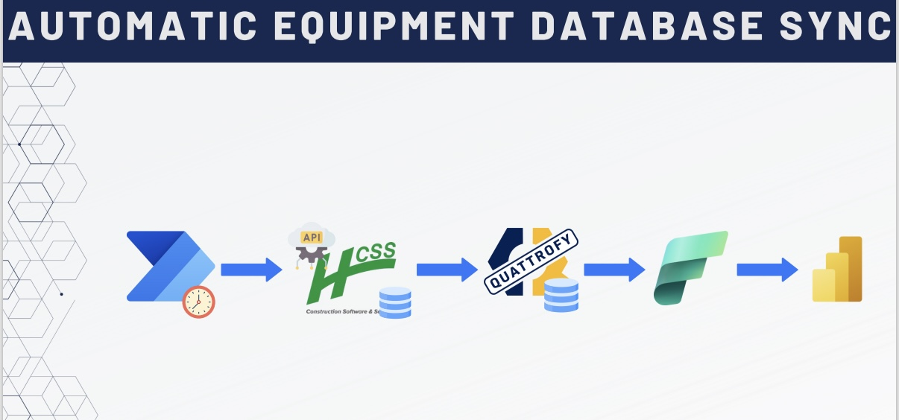
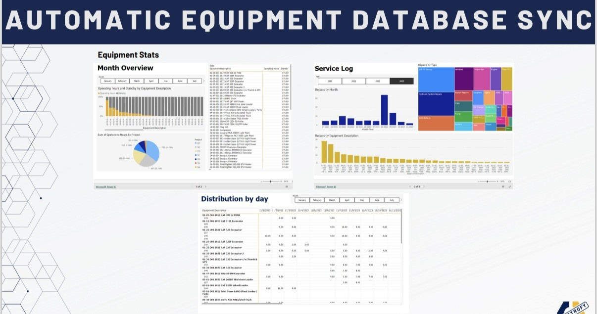

# 🚜 Equipment Data Flow & Power BI Dashboards

## 🧭 Overview
**Equipment Data Flow** is a Microsoft Power Automate flow that automates the synchronization of equipment-related data from the Operations Open API into the Quattrofy platform. This data powers multiple Power BI dashboards, providing real-time insights into equipment usage, service logs, and operational distribution.

## 💡 Objective
To streamline the data retrieval process for equipment operations and transform it into actionable dashboards without manual intervention. The goal is to improve decision-making regarding equipment deployment, maintenance, and efficiency.

### Flow

### Dashboard

---

## ✨ Features
- Recurring Power Automate Flow
- HTTP requests to the Operations API
- JSON parsing and transformation
- Azure SQL storage for structured reporting
- Power BI dashboards for:
  - Monthly utilization
  - Service log history
  - Hour distribution

---

## 📊 Power BI Dashboards
The following dashboards were created from this flow:

### 1. **Monthly Overview Dashboard**
- Filters by month/year
- Equipment list with total hours used
- Bar charts showing utilization by equipment
- Pie chart of equipment count per project

### 2. **Service Log Dashboard**
- Merged data from AI-extracted logs and API data
- Filters by month/project/type of service
- List and chart views of service counts per equipment

### 3. **Hourly Distribution Dashboard**
- Grid view of hours used per equipment per day
- Filter by equipment/project/date
- Helps identify usage patterns and over/under-utilization

---

## ⚙️ Tech Stack

| Category            | Technologies |
|---------------------|--------------|
| **Automation**      |  |
| **API Integration** |  |
| **Database**        |   |
| **Visualization**   |  |
| **Hosting**         |  |

---

## 🔄 Flow Logic
1. **Trigger:** Scheduled to run every few hours
2. **API Call:** Request equipment and usage logs from Operations API
3. **Transformation:** Normalize and clean JSON responses
4. **DB Insertion:** Store in Azure SQL for Power BI consumption
5. **Log Sync Results:** Track data imports for audit and reliability

---

## 📈 Results & Impact
- 🔄 Replaced manual spreadsheet-based equipment tracking
- 📊 Delivered real-time visual dashboards to managers and executives
- ⏱️ Reduced delay from 2–3 days to real-time updates
- 💰 Enabled smarter allocation and servicing decisions

---

## 🔐 Security & Monitoring
- Secured API credentials and access
- Retry logic in Power Automate
- Logged actions to ensure auditability

---

## 🔗 Related Projects
- `Quattrofy` – Main ERP web application
- `AI for Equipment Logs` – Document-based service data extraction
- `Project Sync Flow` – Central data harmonization between systems
